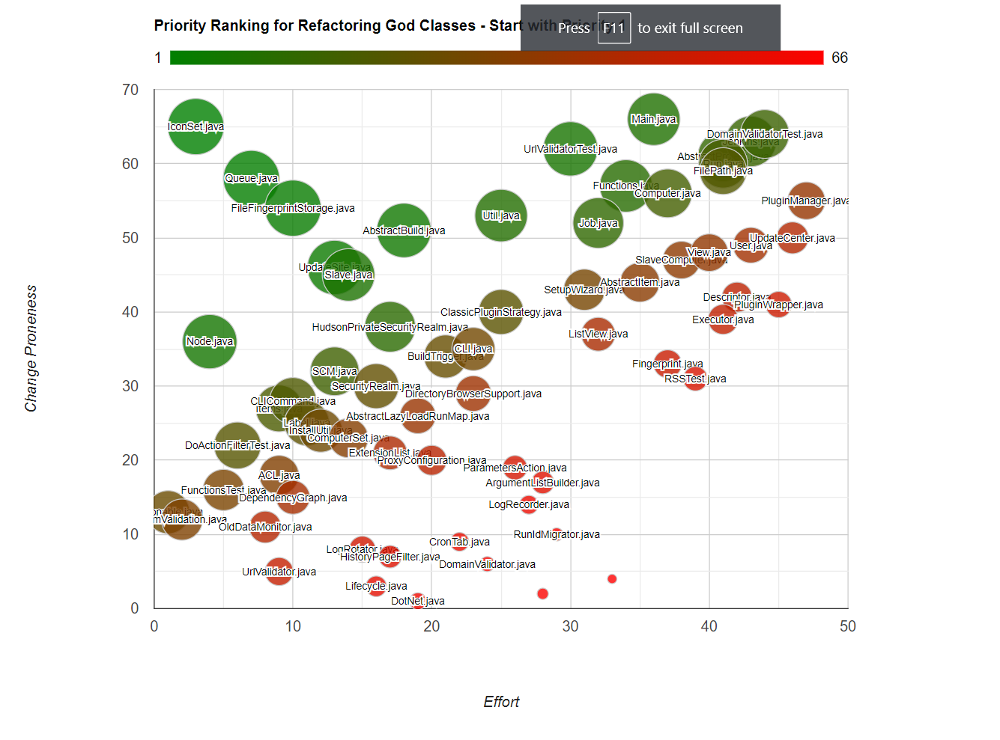

# RefactorFirst

This tool for Java codebases will help you identify the God Classes you should refactor first.
The graph generated in the report will look similar to this one:


## There are several ways to run the analysis on your codebase:

### From The Command Line
Run the following command from the root of your project (the source code does not need to be built):

```bash
mvn org.hjug.refactorfirst.plugin:refactor-first-maven-plugin:0.3.0:report
```

### As Part of a Build
Add the following to your project in the build section.  **showDetails** will show God Class metrics and rankings in the generated table.
```xml
<build>
    <plugins>
        ...
        <plugin>
            <groupId>org.hjug.refactorfirst.plugin</groupId>
            <artifactId>refactor-first-maven-plugin</artifactId>
            <version>0.3.0</version>       
            <!-- optional -->
            <configuration>
                <showDetails>true</showDetails>
            </configuration>
        </plugin>
        ...
    </plugins>
</build>
```

### As a Report
Add the following to your project in the reports section.
Not supported as of Version 0.2.0 due to CVE-2020-13936
```xml
<reporting>
    <plugins>
        ...
        <plugin>
            <groupId>org.hjug.refactorfirst.plugin</groupId>
            <artifactId>refactor-first-maven-plugin</artifactId>
            <version>0.1.1</version>       
        </plugin>
        ...
    </plugins>
</reporting>
```

## Viewing the Report
Once the plugin finishes executing (it may take a while for a large / old codebase), open the file **target/site/refactor-first-report.html** in the root of the project.  It will contain a graph similar to the one above, and a table that lists God classes in the recommended order that they should be refactored.  The classes in the top left of the graph are the easiest to refactor while also having the biggest positive impact to team productivity.


## Additional Details
This plugin will work on both single module and multi-module Maven projects that have a typical Maven project layout.
 
This tool is based on the paper **[Prioritizing Design Debt Investment Opportunities](https://dl.acm.org/doi/10.1145/1985362.1985372)** by Nico Zazworka, Carolyn Seaman, and Forrest Shull.  The presentation based on the paper is available at https://resources.sei.cmu.edu/asset_files/Presentation/2011_017_001_516911.pdf 

## Limitations
* My time.  This is a passion project and is developed in my spare time.

## Feedback and Collaboration Welcome
There is still much to be done.  Your feedback and collaboration would be greatly appreciated in the form of feature requests, bug submissions, and PRs.  
If you find this plugin useful, please star this repository and share with your friends & colleagues and on social media.

## Future Plans
* Add a Gradle plugin.
* Incorporate Unit Test coverage metrics to quickly identify the safety of refactoring a God class.
* Incorporate bug counts per God class to the Impact (Y-Axis) calculation.
* Incorporate more disharmonies from Object Oriented Metrics In Practice (Lanza and Marinescu, 2004).

## Note:
If you are a user of Version 0.1.0 or 0.1.1, you may notice that the list of God classes found by the plugin has changed.  This is due to changes in PMD.

# Thank You!  Enjoy!
