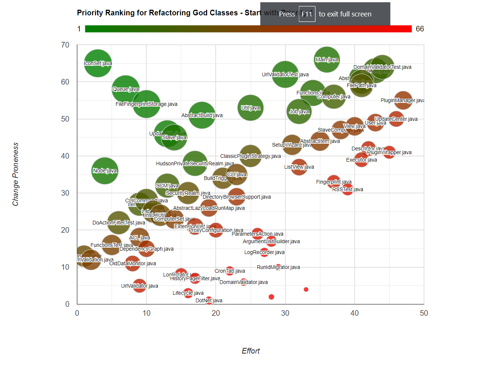

# RefactorFirst

This tool for Java codebases will help you identify what you should refactor first:
- Class and Package Cycles (with cycle images!)
- Object Oriented Disharmonies (a.k.a anti-patterns) identified in [Object Oriented Metrics in Practice](https://link.springer.com/book/10.1007/3-540-39538-5)

It scans your Git repository and generates a single page application by running:
- Cycle analysis on your source code using the [OpenRewrite](https://github.com/openrewrite/rewrite) Java parser and [JGraphT](https://jgrapht.org/)
- What-if analysis to identify the most optimal relationships in a class cycle to remove

Code map viewers are powered by [3D Force Graph](https://vasturiano.github.io/3d-force-graph), [sigma.js](https://www.sigmajs.org/), and [GraphViz DOT](https://graphviz.org/docs/layouts/dot/) using [Vizdom](https://github.com/vizdom-dev/vizdom) to render the DOT graph.
<br>If there are more than 4000 classes + relationships, a simplified 3D viewer will be available to avoid page load slowdowns.  Features will be toggleable in the 3D UI in a future release.

## How to Use RefactorFirst Quickly
Run the command below in your Java project's top-level directory.  You'll need Git, Java 11 (or newer) and Maven 3 installed.  This command will analyze Maven and non-Maven projects:
```bash
mvn org.hjug.refactorfirst.plugin:refactor-first-maven-plugin:0.9.0:htmlReport
```
View the report at ```target/site/refactor-first-report.html``` in your project.
Full instructions for various usage scenarios are below.
Great effort has been taken to make both the analysis and page rendering times as fast as possible.

Take a look at the [JUnit 4 sample report](https://rawcdn.githack.com/refactorfirst/RefactorFirst/10b56c18463b5aab4487de750a72ea4e09188457/junit4-report.html) and [FXGL sample report](https://rawcdn.githack.com/refactorfirst/RefactorFirst/605a59e49884b9b0e03d20cc390f5d476b469a84/fxgl-report.html) (Java + Kotlin)

## Decomposing and Removing Cycles
Cycle analysis is performed with cutting-edge [Directed Feedback Vertex Set](https://dl.acm.org/doi/10.1145/3711669) and [Directed Feedback Arc Set](https://arxiv.org/abs/2208.09234) 
algorithms to identify the optimal classes and relationships between classes for removal to get rid of cycles in your codebase.  
These algorithms are powerful and will push your CPU to its limits for large codebases, though they do play nice and shouldn't slow your computer down.  
These graph algorithms can be used outside of RefactorFirst.  
See [DIAGRAM.md](./graph-algorithms/src/main/java/org/hjug/feedback/vertex/kernelized/DIAGRAM.md) for the flow of the vertex kernelized algorithm.    
See [DIAGRAM.md](./graph-algorithms/src/main/java/org/hjug/feedback/arc/pageRank/DIAGRAM.md) for more details on the arc kernelized algorithm.


### How to understand the Relationship Removal Priority table

The Relationship Removal Priority tables shows the most optimal relationships to remove from your codebase to remove all cycles.  
The table is sorted by the number of cycles that a relationship exists in and then the change proneness of the classes in the relationship.
- Classes that should be broken apart / removed from the codebase have a *.  
- If only one class is bold, the shared functionality should be moved to the non-bold class or classes.  
- If neither class or both classes are bold: examine both classes carefully, reassess the responsibilities of the classes and then refactor to remove the relationship.  If one or both classes are identified as a disharmony, follow the guidance provided for the disharmony.

The graphs generated in the report will look similar to this one:


## Please Note: Java 11 (or newer) required to run RefactorFirst
**Java 25 codebase analysis is supported!**
Please use a recent JDK release of the Java version you are using.  
If you use an old JDK release of your chosen Java version, you may encounter issues during analysis.


## How to use RefactorFirst:
### From The Command Line As an HTML Report
Run the following command from the root of your project (the source code does not need to be built):

```bash
mvn org.hjug.refactorfirst.plugin:refactor-first-maven-plugin:0.9.0:htmlReport
```
View the report at `target/site/refactor-first-report.html`

### [As Part of GitHub Actions Output](https://github.blog/news-insights/product-news/supercharging-github-actions-with-job-summaries/)
This will generate a simplified HTML report (no graphs or images) as the output of a GitHub Action step
```bash
mvn -B clean test \
org.hjug.refactorfirst.plugin:refactor-first-maven-plugin:0.9.0:simpleHtmlReport \
&& echo "$(cat target/site/refactor-first-report.html)" >> $GITHUB_STEP_SUMMARY
```

### As Part of a Build
Add the following to your project in the build section.  **showDetails** will show God Class metrics and rankings in the generated table.
```xml
<build>
    <plugins>
        ...
        <plugin>
            <groupId>org.hjug.refactorfirst.plugin</groupId>
            <artifactId>refactor-first-maven-plugin</artifactId>
            <version>0.9.0</version>       
            <!-- optional -->
            <configuration>
                <showDetails>false</showDetails>
            </configuration>
        </plugin>
        ...
    </plugins>
</build>
```

### As a Maven Report
Add the following to your project in the reports section.   
A RefactorFirst report will show up in the site report when you run ```mvn site```
```xml
<reporting>
    <plugins>
        ...
        <plugin>
            <groupId>org.hjug.refactorfirst.plugin</groupId>
            <artifactId>refactor-first-maven-plugin</artifactId>
            <version>0.9.0</version>       
        </plugin>
        ...
    </plugins>
</reporting>
```

## Configuration Options
Care has been taken to use sensible defaults, though if you wish to override these defaults you can specify the following parameters.
Specify with -D if running on the command line.  e.g. ```-DbackEdgeAnalysisCount=0 `DanalyzeCycles=false``` or in the configuration section (as in the above examples) if including in a Maven build.

|Option|Action| Default                                                   |
|------|------|-----------------------------------------------------------|
|showDetails|Shows God Class metrics| false                                                     |
|backEdgeAnalysisCount|Number of back edges in a cycle to analyze.  <br>If total number of back edges is greater than the value specified, it analyzes the number of minimum weight edges specified.<br>**If 0 is specified, all back edges will be analyzed**| 50                                                        |
|analyzeCycles|Analyzes the 10 largest cycles (will be configurable in the future)| true                                                      |
|minifyHtml|Minifies the generated HTML report.  Only available on ```htmlReport``` and ```simpleHtmlReport``` goals.  May cause issues with large reports.| false                                                     |
|excludeTests|Exclude test classes from analysis| true                                                      |
|testSrcDirectory|Excludes classes containing this pattern from analysis| ```src/test```                         |
|projectName|The name of your project to be displayed on the report| Your Maven project name                                   |
|projectVersion|The version of your project to be displayed on the report| Your Maven project version                                |
|outputDirectory|The location the project report will be written| ```${projectDir}/target/site/refactor-first-report.html``` 


## But I'm using Gradle / my project layout isn't typical!
I plan to create a Gradle plugin and (possibly) support non-conventional project structures in the future, but in the meantime you can create a dummy POM file in the same directory as your .git directory to show your project's name in the report:

```xml
<project xmlns="http://maven.apache.org/POM/4.0.0" xmlns:xsi="http://www.w3.org/2001/XMLSchema-instance"
  xsi:schemaLocation="http://maven.apache.org/POM/4.0.0 http://maven.apache.org/xsd/maven-4.0.0.xsd">
  <modelVersion>4.0.0</modelVersion>
 
  <groupId>com.mycompany.app</groupId>
  <artifactId>my-app</artifactId>
  <version>1.0-SNAPSHOT</version>
</project>
```
and then (assuming Maven is installed) run

```bash
mvn org.hjug.refactorfirst.plugin:refactor-first-maven-plugin:0.9.0:htmlReport
```

### Seeing Errors?

If you see an error similar to
```
 Execution default-site of goal org.apache.maven.plugins:maven-site-plugin:3.3:site failed: A required class was missing while executing org.apache.maven.plugins:maven-site-plugin:3.3:site: org/apache/maven/doxia/siterenderer/DocumentContent
```
you will need to add the following to your pom.xml:
```xml
  <build>
    <plugins>        
      <plugin>
        <groupId>org.apache.maven.plugins</groupId>
        <artifactId>maven-site-plugin</artifactId>
        <version>3.12.1</version>
      </plugin>
      <plugin>
        <groupId>org.apache.maven.plugins</groupId>
        <artifactId>maven-project-info-reports-plugin</artifactId>
        <version>3.4.5</version>
      </plugin>
    </plugins>
  </build>
```

## Viewing the Report
View the report at ```target/site/refactor-first-report.html```   
Once the plugin finishes executing (it may take a while for a large / old codebase), open the file **target/site/refactor-first-report.html** in the root of the project.  It will contain a graph similar to the one above, and a table that lists God classes in the recommended order that they should be refactored.  The classes in the top left of the graph are the easiest to refactor while also having the biggest positive impact to team productivity.  
If highly coupled classes are detected, a graph and table listing Highly Coupled Classes in will be generated.

## I have the report.  Now What???
Work with your Product Owner to prioritize the technical debt that has been identified.  It may help to explain it as hidden negative value that is slowing team porductivity.  
If you have IntelliJ Ultimate, you can install the [Method Reference Diagram](https://plugins.jetbrains.com/plugin/7996-java-method-reference-diagram) plugin to help you determine how the identified God classes and Highly Coupled classes can be refactored.


## Additional Details
This plugin will work on both single module and multi-module Maven projects that have a typical Maven project layout.
 
This tool is based on the paper **[Prioritizing Design Debt Investment Opportunities](https://dl.acm.org/doi/10.1145/1985362.1985372)** by Nico Zazworka, Carolyn Seaman, and Forrest Shull.  The presentation based on the paper is available at https://resources.sei.cmu.edu/asset_files/Presentation/2011_017_001_516911.pdf 

## Limitations
* My time.  This is a passion project and is developed in my spare time.

## Feedback and Collaboration Welcome
There is still much to be done.  Your feedback and collaboration would be greatly appreciated in the form of feature requests, bug submissions, and PRs.  
If you find this plugin useful, please star this repository and share with your friends & colleagues and on social media.

## Future Plans
* Add a Gradle plugin.
* Incorporate Unit Test coverage metrics to quickly identify the safety of refactoring classes.
* Incorporate additional meaningful metrics.

## Note:
If you are a user of Version 0.8.0 or older, you may notice that the list of God classes found by the plugin has changed starting in version 0.9.0.  This is due to the fact that the God class metric used starting with version 0.9.0 is faithful to the metric parameters defined in Object Oriented Metrics in Practice.

# Thank You!  Enjoy!
