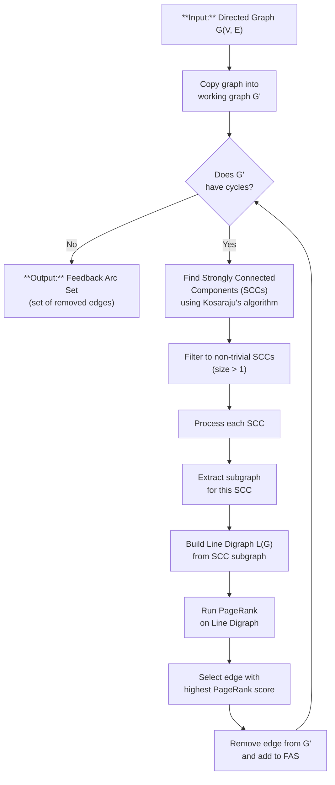
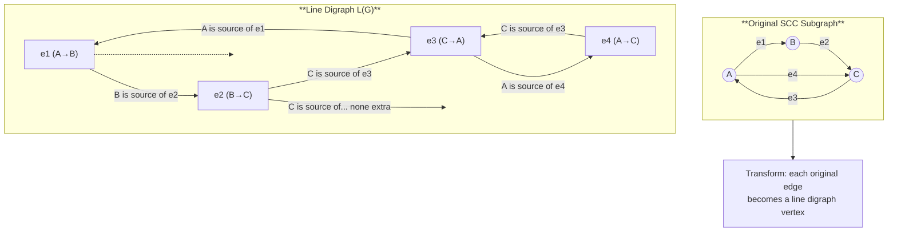
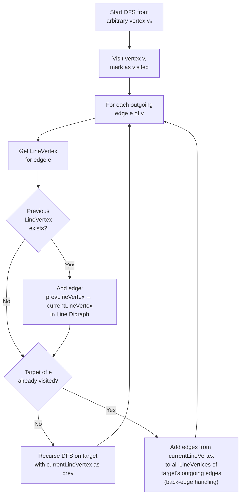
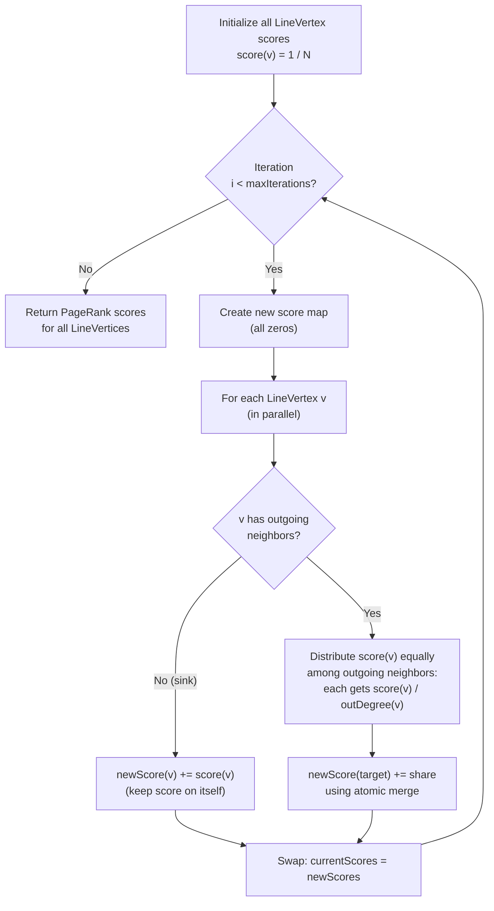
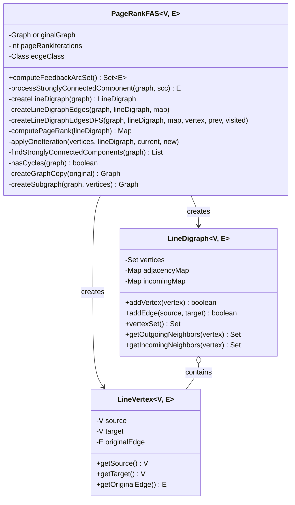

# PageRank Feedback Arc Set (PageRankFAS) Algorithm

Based on the paper *"Computing a Feedback Arc Set Using PageRank"* by Geladaris, Lionakis, and Tollis ([arXiv:2208.09234](https://arxiv.org/abs/2208.09234)).

## High-Level Algorithm Flow

## Line Digraph Construction

Each edge in the original graph becomes a **vertex** in the line digraph. Edges in the line digraph represent adjacency (consecutive traversal) in the original graph.

## Line Digraph Edge Creation (DFS-Based — Algorithm 3)

## PageRank Computation (Algorithm 4)

## Selecting the Feedback Edge

## Class Relationships

