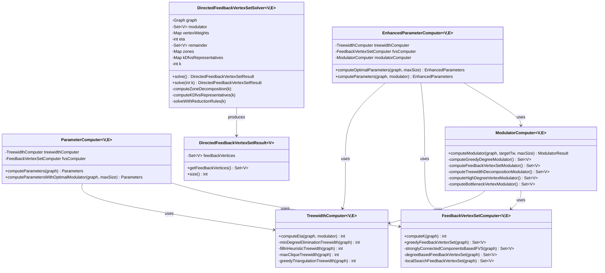
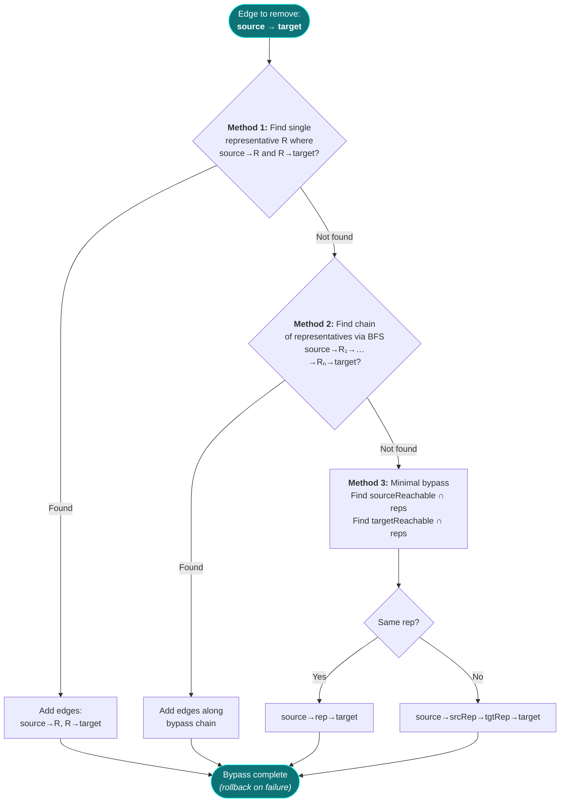
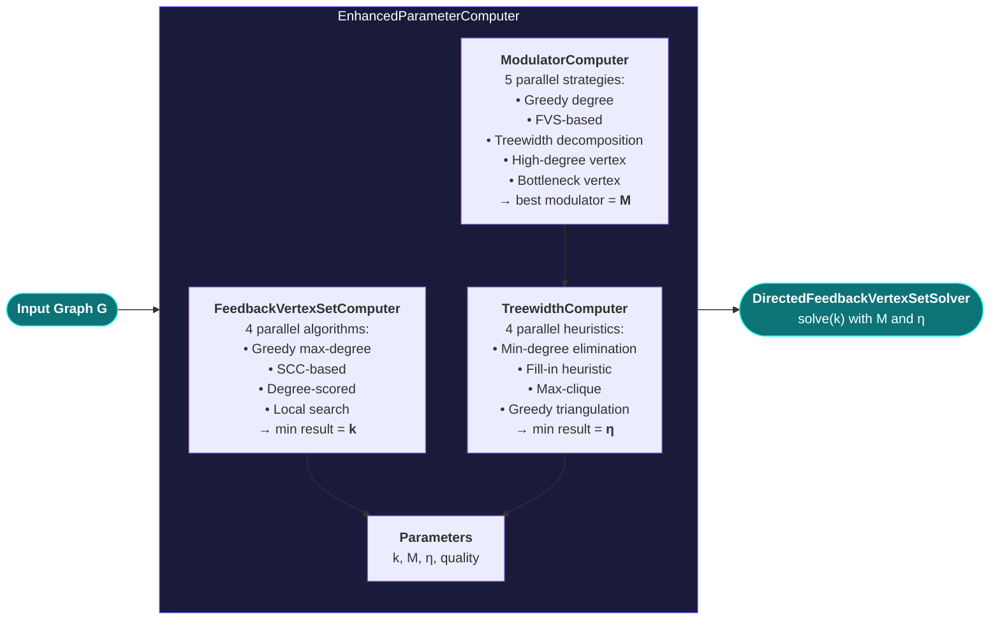

# Kernelized Directed Feedback Vertex Set (DFVS) Algorithm

Based on: *"Wannabe Bounded Treewidth Graphs Admit a Polynomial Kernel for DFVS"* (Lokshtanov et al.)  
https://doi.org/10.1145/3711669
## Class Architecture

## Algorithm Overview — Three-Phase Kernelization

```mermaid
flowchart TD
    Start(["`**Input:** Directed graph G, modulator M, treewidth η, weights`"]) --> SCC

    SCC["`**Compute default k**
    Kosaraju SCC count as lower bound`"]
    SCC --> P1

    subgraph P1["Phase 1 — Zone Decomposition"]
        direction TB
        P1A["`**Remove modulator** from graph
        G' = G ∖ M`"]
        P1A --> P1B["`**Compute minimal FVS** S
        in G' (greedy, up to k vertices)`"]
        P1B --> P1C{"|S| > k?"}
        P1C -- Yes --> NO_INST(["`**NO-instance**
        return empty`"])
        P1C -- No --> P1D["`**Compute flow-blocker F**
        For each modulator pair (u,v):
        find min vertex cut ≤ k in G'`"]
        P1D --> P1E["`**Compute remainder R**
        R = S ∪ F
        Bound: |R| ≤ 2k(η+1)(|M|²+1)`"]
        P1E --> P1F["`**Partition into zones**
        Vertices not in M or R →
        connected components = zones`"]
    end

    P1 --> P2

    subgraph P2["Phase 2 — k-DFVS Representative Marking"]
        direction TB
        P2A["`**For each zone Z** (in parallel):`"]
        P2A --> P2B["`Compute **SCCs** within zone subgraph`"]
        P2B --> P2C["`From each non-trivial SCC,
        select **highest-degree vertex**
        as representative`"]
        P2C --> P2D["`Bound representative size:
        |rep| ≤ (k · |M|)^(η²)`"]
    end

    P2 --> P3

    subgraph P3["Phase 3 — Reduction Rules & Solve"]
        direction TB
        P3A["`**Apply Reduction Rules 5 & 6**
        For each zone:`"]
        P3A --> P3B["`Identify **non-representative**
        zone vertices`"]
        P3B --> P3C["`Remove edges between
        **modulator ↔ non-representative**
        vertices`"]
        P3C --> P3D["`**Add bypass edges** through
        representatives to preserve
        cycle structure`"]
        P3D --> P3E["`**Solve kernelized instance**
        Collect all representatives +
        high-degree remainder vertices`"]
    end

    P3 --> Result(["`**Output:** DirectedFeedbackVertexSetResult
    containing the DFVS`"])

    style P1 fill:#1a3a5c,stroke:#4a9eff,color:#fff
    style P2 fill:#3a1a5c,stroke:#9a4aff,color:#fff
    style P3 fill:#5c3a1a,stroke:#ff9a4a,color:#fff
    style Start fill:#0d7377,stroke:#14ffec,color:#fff
    style Result fill:#0d7377,stroke:#14ffec,color:#fff
    style NO_INST fill:#7a1a1a,stroke:#ff4a4a,color:#fff
```

## Bypass Edge Creation Detail

## Parameter Computation Pipeline

## Key Concepts

| Symbol | Meaning |
|--------|---------|
| **G** | Input directed graph |
| **M** (modulator) | Set of vertices whose removal yields a bounded-treewidth graph |
| **η** (eta) | Treewidth of G ∖ M (undirected) |
| **k** | Size of the minimum directed feedback vertex set |
| **S** | Minimal FVS of G ∖ M |
| **F** | Flow-blocker — min vertex cuts between modulator pairs |
| **R** | Remainder = S ∪ F |
| **Zones** | Connected components of V ∖ (M ∪ R) |
| **Representatives** | Highest-degree vertices from each non-trivial SCC per zone |
| **Kernel bound** | (k · \|M\|)^O(η²) |
