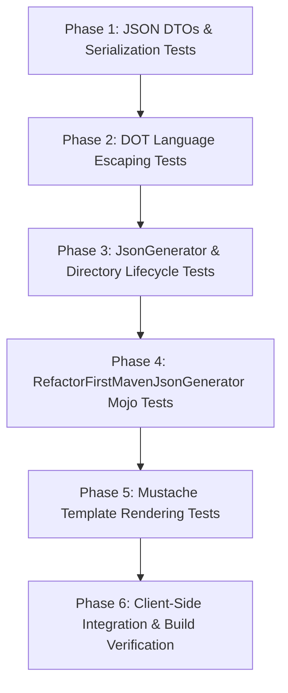

# RefactorFirst Mustache Template & JSON Generator Implementation Plan

## Executive Summary

This plan outlines the end-to-end implementation of a decoupled, data-driven reporting system for RefactorFirst. The goal is to modernize the current report generation pipeline—which currently relies on server-side monolithic string concatenation in [`HtmlReport`](file:///C:/Code/RefactorFirst/report/src/main/java/org/hjug/refactorfirst/report/HtmlReport.java) and Google Charts in [`GraphDataGenerator`](file:///C:/Code/RefactorFirst/graph-data-generator/src/main/java/org/hjug/gdg/GraphDataGenerator.java)—by introducing:

1. **[`JsonGenerator`](file:///C:/Code/RefactorFirst/report/src/main/java/org/hjug/refactorfirst/report/JsonGenerator.java)**: A dedicated generator adjacent to [`HtmlReport`](file:///C:/Code/RefactorFirst/report/src/main/java/org/hjug/refactorfirst/report/HtmlReport.java) that exports all codebase analysis results, metrics, graph metadata, and properly escaped Graphviz DOT language into a clean JSON file named `refactor-first.json` inside a `.refactorfirst` directory (creating directory and file if missing, overwriting if existing).
2. **[`RefactorFirstMavenJsonGenerator`](file:///C:/Code/RefactorFirst/refactor-first-maven-plugin/src/main/java/org/hjug/mavenreport/RefactorFirstMavenJsonGenerator.java)**: A Maven plugin Mojo adjacent to [`RefactorFirstHtmlReport`](file:///C:/Code/RefactorFirst/refactor-first-maven-plugin/src/main/java/org/hjug/mavenreport/RefactorFirstHtmlReport.java) that extends [`AbstractMojo`](file:///C:/Code/RefactorFirst/refactor-first-maven-plugin/src/main/java/org/hjug/mavenreport/RefactorFirstHtmlReport.java#L21) and invokes [`JsonGenerator`](file:///C:/Code/RefactorFirst/report/src/main/java/org/hjug/refactorfirst/report/JsonGenerator.java).
3. **Mustache Template (`refactor-first-report.mustache`)**: A Mustache template replicating the complete HTML report structure currently produced by [`HtmlReport`](file:///C:/Code/RefactorFirst/report/src/main/java/org/hjug/refactorfirst/report/HtmlReport.java), matching the sample output in [`refactor-first-report.html`](file:///C:/Code/junit4/target/site/refactor-first-report.html).
4. **Client-Side HTML Runner (`index.html`)**: An HTML viewer that loads the JSON data and Mustache template purely in the browser using client-side JavaScript modules (`<script type="module">`). **No Node.js, Bun, NPM, or server-side rendering is used**.
5. **Chart.js Bubble Chart Integration**: Full replacement of [`GraphDataGenerator`](file:///C:/Code/RefactorFirst/graph-data-generator/src/main/java/org/hjug/gdg/GraphDataGenerator.java) with [Chart.js](https://www.chartjs.org/) to render interactive disharmony bubble charts from the JSON data.
6. **Strict Test-Driven Development (TDD)**: Step-by-step Red-Green-Refactor cycles across all modules.

---

## Architectural Analysis & Comparison

### Current Architecture vs. Target Architecture

```
CURRENT ARCHITECTURE (Monolithic String Concatenation):
+--------------------+      +---------------------------------+
| CycleRanker / CBC  | ---> | HtmlReport extends              | ---> refactor-first-report.html
| Analysis Pipeline  |      | SimpleHtmlReport                |      (Includes Google Charts
+--------------------+      | (Inlines HTML, DOT, & JS string)|       via GraphDataGenerator)
                            +---------------------------------+

TARGET ARCHITECTURE (Decoupled Headless JSON + Client-Side Template):
+--------------------+      +---------------------------------+      +------------------------------+
| CycleRanker / CBC  | ---> | JsonGenerator                   | ---> | .refactorfirst/              |
| Analysis Pipeline  |      | (Extracts DTOs & Escapes DOT)   |      | refactor-first.json          |
+--------------------+      +---------------------------------+      +------------------------------+
                                                                                    |
                                                                                    v (Fetch / Load)
+------------------------------------+      +-------------------------------------------------------+
| refactor-first-report.mustache     | ---> | Client-Side Browser Runner (index.html)               |
| (Semantic HTML, Tables, Placeholders)     | (Mustache.js + Chart.js v4 + Vizdom WASM Graphviz)    |
+------------------------------------+      +-------------------------------------------------------+
```

### Key Differences & Improvements

| Feature | Current Implementation (`HtmlReport`) | Target Implementation (`JsonGenerator` + Mustache) |
| :--- | :--- | :--- |
| **Output Format** | Hardcoded monolithic HTML string | Structured, schema-validated `refactor-first.json` |
| **Storage Location** | `target/site/refactor-first-report.html` | `.refactorfirst/refactor-first.json` + static template/runner |
| **Graph Visualization** | Server-side template literals embedded in `<script>` | Escaped DOT string in JSON; rendered client-side via Vizdom/Sigma |
| **Disharmony Charts** | External Google Charts API via [`GraphDataGenerator`](file:///C:/Code/RefactorFirst/graph-data-generator/src/main/java/org/hjug/gdg/GraphDataGenerator.java) | Modern client-side [Chart.js](https://www.chartjs.org/) bubble charts (offline-ready, zero Google dependency) |
| **Rendering Pipeline** | Server-side `StringBuilder` appending in Java | Pure client-side JavaScript (`Mustache.render()`) in browser |
| **Server Runtime** | Maven execution | No Node.js / Bun / NPM runtime required |

---

## Detailed Component Specifications

### 1. `JsonGenerator`
- **Location**: [`../report/src/main/java/org/hjug/refactorfirst/report/JsonGenerator.java`](file:///C:/Code/RefactorFirst/report/src/main/java/org/hjug/refactorfirst/report/JsonGenerator.java) (adjacent to [`HtmlReport.java`](file:///C:/Code/RefactorFirst/report/src/main/java/org/hjug/refactorfirst/report/HtmlReport.java)).
- **Package**: `org.hjug.refactorfirst.report`
- **Target File Path**: `.refactorfirst/refactor-first.json` relative to `projectBaseDir`.
- **Directory & File Lifecycle**:
  - Checks if the `.refactorfirst` directory exists; if not, creates it via `Files.createDirectories()`.
  - Checks if `refactor-first.json` exists; if it does, atomically truncates and replaces it; if not, creates it.
  - Implements safe atomic writing (e.g. write to a temporary file in `.refactorfirst` and atomically move via `Files.move(..., StandardCopyOption.ATOMIC_MOVE, StandardCopyOption.REPLACE_EXISTING)`).
- **Core Orchestration**:
  - Reuses or collaborates with the analysis pipeline: [`CycleRanker`](file:///C:/Code/RefactorFirst/report/src/main/java/org/hjug/refactorfirst/report/SimpleHtmlReport.java#L172), [`CycleRemovalComputer`](file:///C:/Code/RefactorFirst/report/src/main/java/org/hjug/refactorfirst/report/SimpleHtmlReport.java#L188), and [`CostBenefitCalculator`](file:///C:/Code/RefactorFirst/report/src/main/java/org/hjug/refactorfirst/report/SimpleHtmlReport.java#L323).
  - Uses [`HtmlReport`](file:///C:/Code/RefactorFirst/report/src/main/java/org/hjug/refactorfirst/report/HtmlReport.java)'s DOT generation logic ([`buildClassGraphDot`](file:///C:/Code/RefactorFirst/report/src/main/java/org/hjug/refactorfirst/report/HtmlReport.java#L564), [`buildPackageGraphDot`](file:///C:/Code/RefactorFirst/report/src/main/java/org/hjug/refactorfirst/report/HtmlReport.java#L999), [`buildClassCycleDot`](file:///C:/Code/RefactorFirst/report/src/main/java/org/hjug/refactorfirst/report/HtmlReport.java#L945)) to extract raw Graphviz DOT strings.
  - Serializes the root model using Jackson's `ObjectMapper` with pretty printing enabled.

### 2. `RefactorFirstMavenJsonGenerator`
- **Location**: [`../refactor-first-maven-plugin/src/main/java/org/hjug/mavenreport/RefactorFirstMavenJsonGenerator.java`](file:///C:/Code/RefactorFirst/refactor-first-maven-plugin/src/main/java/org/hjug/mavenreport/RefactorFirstMavenJsonGenerator.java) (adjacent to [`RefactorFirstHtmlReport.java`](file:///C:/Code/RefactorFirst/refactor-first-maven-plugin/src/main/java/org/hjug/mavenreport/RefactorFirstHtmlReport.java)).
- **Package**: `org.hjug.mavenreport`
- **Superclass**: [`AbstractMojo`](file:///C:/Code/RefactorFirst/refactor-first-maven-plugin/src/main/java/org/hjug/mavenreport/RefactorFirstHtmlReport.java#L21)
- **Mojo Annotation**:
  ```java
  @Mojo(
          name = "jsonReport",
          defaultPhase = LifecyclePhase.SITE,
          requiresDependencyResolution = ResolutionScope.RUNTIME,
          requiresProject = false,
          threadSafe = true,
          inheritByDefault = false)
  public class RefactorFirstMavenJsonGenerator extends AbstractMojo { ... }
  ```
- **Configuration Parameters**:
  - `showDetails`: boolean (default: `false`)
  - `backEdgeAnalysisCount`: int (default: `50`)
  - `analyzeCycles`: boolean (default: `true`)
  - `excludeTests`: boolean (default: `true`)
  - `testSourceDirectory`: String (optional)
  - `projectName`: String (default: `${project.name}`)
  - `projectVersion`: String (default: `${project.version}`)
  - `project`: MavenProject (default: `${project}`)
  - `outputDirectory`: File (default: `${project.build.directory}`)
- **Execution Flow**:
  - Resolves `project.getBasedir()`.
  - Instantiates `JsonGenerator` and invokes `execute(...)` passing all analysis parameters.

### 3. DOT Language Escaping Strategy in JSON
When embedding Graphviz DOT language into JSON, correct escaping is critical to avoid invalid JSON syntax and client-side rendering corruption:
- **Jackson Native Escaping**: The Graphviz digraph string contains quotes (`label="Assert"`), backslashes (`\$anonymous`), newlines, and tabs. Jackson's `ObjectMapper.writeValueAsString()` automatically escapes these according to the JSON specification (`"` $\rightarrow$ `\"`, `\` $\rightarrow$ `\\`, `\n` $\rightarrow$ `\n`).
- **Separation of Raw DOT from JS Literals**: Unlike [`HtmlReport.toJavaScriptTemplateLiteral`](file:///C:/Code/RefactorFirst/report/src/main/java/org/hjug/refactorfirst/report/HtmlReport.java#L1102) which wrapped strings in backticks and replaced `<`/`>` with `\u003C`/`\u003E`, the `JsonGenerator` keeps the DOT string in its canonical Graphviz syntax in the JSON property `dot`.
- **Inner Classes & Kotlin Anonymous Types**:
  - Java inner classes use `Outer$Inner` where `$` is escaped as `\$` for DOT labels.
  - Kotlin anonymous classes use safe node IDs derived in [`HtmlReport.renderSafeNodeId`](file:///C:/Code/RefactorFirst/report/src/main/java/org/hjug/refactorfirst/report/HtmlReport.java#L672) (e.g. `DeveloperWASDControl_anonymous`) and labels like `DeveloperWASDControl\$anonymous`.
- **Client-Side Deserialization**: When the client-side JavaScript reads the JSON (via `JSON.parse` or `response.json()`), the DOT string in memory is unescaped to raw Graphviz syntax, ready to be passed directly to `Vizdom.parse(dot)` and `graphlibDot.read(dot)`.

### 4. Chart.js Bubble Chart Data & Replacement of `GraphDataGenerator`
[`GraphDataGenerator`](file:///C:/Code/RefactorFirst/graph-data-generator/src/main/java/org/hjug/gdg/GraphDataGenerator.java) currently emits Google Charts scripts:
`['ID', 'Effort', 'Change Proneness', 'Priority', 'Priority (Visual)']`.

In `JsonGenerator`, we structure the disharmony chart data specifically for **Chart.js v4**:
- **Dataset Structure**:
  ```json
  "chart": {
    "xAxisLabel": "Effort to refactor",
    "yAxisLabel": "Relative churn",
    "bubbles": [
      {
        "id": "ComparisonCompactor",
        "label": "ComparisonCompactor.java",
        "x": 2,
        "y": 14,
        "r": 18,
        "priority": 1,
        "effortRank": 2,
        "changePronenessRank": 14,
        "color": "rgba(235, 64, 52, 0.75)",
        "borderColor": "rgb(235, 64, 52)"
      }
    ]
  }
  ```
- **Bubble Radius Calculation**:
  In Google Charts, visual priority was calculated as `maxPriority - priority`. For Chart.js pixels, we calculate radius dynamically:
  $$r = \text{minRadius} + \left(\frac{\text{maxPriority} - \text{priority}}{\max(1, \text{maxPriority} - 1)}\right) \times (\text{maxRadius} - \text{minRadius})$$
  *(e.g. minRadius = 6px, maxRadius = 24px)*, guaranteeing that Priority 1 disharmonies are prominent and distinguishable.
- **Color Gradient Interpolation**:
  Priority 1 is rendered in bright red (`#e74c3c`), interpolating through amber (`#f39c12`) to green (`#27ae60`) for the lowest priority.

---

## JSON Data Schema (`refactor-first.json`)

Below is the complete schema design representing all elements from [`refactor-first-report.html`](file:///C:/Code/junit4/target/site/refactor-first-report.html):

```json
{
  "$schema": "http://json-schema.org/draft-07/schema#",
  "title": "RefactorFirstReport",
  "type": "object",
  "properties": {
    "project": {
      "type": "object",
      "properties": {
        "name": { "type": "string" },
        "version": { "type": "string" },
        "repoUrl": { "type": "string" },
        "baseDir": { "type": "string" },
        "scanTimestamp": { "type": "string" },
        "hasAnyDisharmony": { "type": "boolean" }
      },
      "required": ["name", "version", "repoUrl", "scanTimestamp", "hasAnyDisharmony"]
    },
    "classMap": {
      "type": "object",
      "properties": {
        "graphId": { "type": "string" },
        "classCount": { "type": "integer" },
        "relationshipCount": { "type": "integer" },
        "dotThreshold": { "type": "integer" },
        "dotThresholdExceeded": { "type": "boolean" },
        "dot": { "type": "string" }
      },
      "required": ["graphId", "classCount", "relationshipCount", "dot"]
    },
    "classRelationshipsToRemove": {
      "type": "object",
      "properties": {
        "cycleCount": { "type": "integer" },
        "relationshipsToRemoveCount": { "type": "integer" },
        "relationships": {
          "type": "array",
          "items": {
            "type": "object",
            "properties": {
              "sourceClass": { "type": "string" },
              "targetClass": { "type": "string" },
              "sourceUrl": { "type": "string" },
              "targetUrl": { "type": "string" },
              "sourceMarked": { "type": "boolean" },
              "targetMarked": { "type": "boolean" },
              "weight": { "type": "integer" },
              "renderedLabel": { "type": "string" },
              "priority": { "type": "integer" },
              "cycleCount": { "type": "integer" },
              "effortRank": { "type": "integer" },
              "alsoRemovesPackageRelationship": { "type": "boolean" },
              "packageCycleCount": { "type": "integer" }
            }
          }
        }
      }
    },
    "packageMap": {
      "type": "object",
      "properties": {
        "hasEdges": { "type": "boolean" },
        "graphId": { "type": "string" },
        "packageCount": { "type": "integer" },
        "relationshipCount": { "type": "integer" },
        "dotThresholdExceeded": { "type": "boolean" },
        "dot": { "type": "string" }
      }
    },
    "packageRelationshipsToRemove": {
      "type": "object",
      "properties": {
        "cycleCount": { "type": "integer" },
        "relationshipsToRemoveCount": { "type": "integer" },
        "relationships": {
          "type": "array",
          "items": {
            "type": "object",
            "properties": {
              "sourcePackage": { "type": "string" },
              "targetPackage": { "type": "string" },
              "sourceMarked": { "type": "boolean" },
              "targetMarked": { "type": "boolean" },
              "weight": { "type": "integer" },
              "renderedLabel": { "type": "string" },
              "priority": { "type": "integer" },
              "cycleCount": { "type": "integer" },
              "effortRank": { "type": "integer" },
              "classRelationshipsToBreakPackage": {
                "type": "array",
                "items": { "type": "string" }
              }
            }
          }
        }
      }
    },
    "disharmonies": {
      "type": "array",
      "items": {
        "type": "object",
        "properties": {
          "type": { "type": "string" },
          "anchorId": { "type": "string" },
          "title": { "type": "string" },
          "methodLevel": { "type": "boolean" },
          "problem": { "type": "string" },
          "solution": { "type": "string" },
          "maxPriority": { "type": "integer" },
          "chart": {
            "type": "object",
            "properties": {
              "canvasId": { "type": "string" },
              "xAxisLabel": { "type": "string" },
              "yAxisLabel": { "type": "string" },
              "bubbles": { "type": "array" }
            }
          },
          "table": {
            "type": "object",
            "properties": {
              "headers": { "type": "array", "items": { "type": "string" } },
              "rows": { "type": "array" }
            }
          }
        }
      }
    },
    "classCycles": {
      "type": "object",
      "properties": {
        "hasCycles": { "type": "boolean" },
        "summary": {
          "type": "array",
          "items": {
            "type": "object",
            "properties": {
              "cycleName": { "type": "string" },
              "priority": { "type": "integer" },
              "classCount": { "type": "integer" },
              "relationshipCount": { "type": "integer" }
            }
          }
        },
        "largestCycle": {
          "type": "object",
          "properties": {
            "hasCycleMap": { "type": "boolean" },
            "cycleName": { "type": "string" },
            "cycleIdentifier": { "type": "string" },
            "classCount": { "type": "integer" },
            "relationshipCount": { "type": "integer" },
            "dot": { "type": "string" },
            "breakdown": { "type": "array" }
          }
        }
      }
    }
  }
}
```

---

## Mustache Template Design (`refactor-first-report.mustache`)

The Mustache template replicates the structure and styling of [`refactor-first-report.html`](file:///C:/Code/junit4/target/site/refactor-first-report.html). It will be located at:
[`../report/src/main/resources/templates/refactor-first-report.mustache`](file:///C:/Code/RefactorFirst/report/src/main/resources/templates/refactor-first-report.mustache).

### Template Sections

```html
<!DOCTYPE html>
<html xmlns="http://www.w3.org/1999/xhtml" xml:lang="en" lang="en">
<head>
    <meta charset="utf-8"/>
    <title>Refactor First Report for {{project.name}} {{project.version}}</title>
    <!-- CDN Dependencies -->
    <script async defer src="https://buttons.github.io/buttons.js"></script>
    <script src="https://cdn.jsdelivr.net/npm/chart.js@4.4.7/dist/chart.umd.min.js"></script>
    <script src="https://cdn.jsdelivr.net/npm/svg-pan-zoom@3.6.1/dist/svg-pan-zoom.min.js"></script>
    <script src="https://cdnjs.cloudflare.com/ajax/libs/sigma.js/2.4.0/sigma.min.js"></script>
    <script src="https://cdnjs.cloudflare.com/ajax/libs/graphology/0.25.4/graphology.umd.min.js"></script>
    <script src="https://cdn.jsdelivr.net/npm/graphlib-dot@0.6.4/dist/graphlib-dot.min.js"></script>
    <script src="https://cdn.jsdelivr.net/npm/3d-force-graph"></script>
    <script type="module" src="https://cdn.jsdelivr.net/npm/@vizdom/vizdom-ts-web@0.1.19/vizdom_ts.min.js"></script>
    <link rel="stylesheet" href="https://unpkg.com/mvp.css">
    
    <style>
        main { max-width: 100vw; width: 100vw; padding: 0px 0px; }
        nav { justify-content: center; padding: 0px 40px; margin: 0px auto; }
        header { padding: 0px 40px; }
        .fullscreen-svg { width: 100%; height: 100%; }
        .popup { position: fixed; display: none; width: 95%; height: 95%; background-color: white; border: 1px solid #ccc; box-shadow: 0 0 10px rgba(0, 0, 0, 0.1); top: 50%; left: 50%; transform: translate(-50%, -50%); z-index: 1000; padding: 20px; box-sizing: border-box; }
        .overlay { position: fixed; display: none; width: 100%; height: 100%; top: 0; left: 0; background: rgba(0, 0, 0, 0.5); z-index: 999; }
        .close-btn { position: absolute; top: 10px; right: 10px; cursor: pointer; font-size: 20px; font-weight: bold; }
        .chart-container { max-width: 1100px; margin: 20px auto; }
    </style>
</head>
<body class="composite">
    <div class="overlay" id="overlay" onclick="hidePopup()"></div>

    <!-- Header & Navigation -->
    <header>
        <h1 align="center">
            <a href="https://github.com/refactorfirst/refactorfirst" target="_blank">RefactorFirst</a> Report for 
            <a href="{{project.repoUrl}}" target="_blank">{{project.name}} {{project.version}}</a>
        </h1>
        
        <!-- GitHub Support Badges -->
        <div align="center">
            <h2>Show RefactorFirst some &#10084;&#65039;</h2>
            <a class="github-button" href="https://github.com/refactorfirst/refactorfirst" data-icon="octicon-star" data-size="large" data-show-count="true">Star</a>
            <a class="github-button" href="https://github.com/refactorfirst/refactorfirst/fork" data-icon="octicon-repo-forked" data-size="large" data-show-count="true">Fork</a>
            <a class="github-button" href="https://github.com/refactorfirst/refactorfirst/subscription" data-icon="octicon-eye" data-size="large" data-show-count="true">Watch</a>
            <a class="github-button" href="https://github.com/refactorfirst/refactorfirst/issues" data-icon="octicon-issue-opened" data-size="large">Issue</a>
            <a class="github-button" href="https://github.com/sponsors/jimbethancourt" data-icon="octicon-heart" data-size="large">Sponsor</a>
        </div>

        <nav>
            <ul>
                <li><a href="#">Classes</a>
                    <ul>
                        <li><a href="#CLASSMAP">Class Map</a></li>
                        {{#classRelationshipsToRemove.relationships.length}}
                        <li><a href="#CLASSEDGES">Class Relationships To Remove</a></li>
                        {{/classRelationshipsToRemove.relationships.length}}
                    </ul>
                </li>
                {{#packageMap.hasEdges}}
                <li><a href="#">Packages</a>
                    <ul>
                        <li><a href="#PACKAGEMAP">Package Map</a></li>
                        {{#packageRelationshipsToRemove.relationships.length}}
                        <li><a href="#PACKAGEEDGES">Package Relationships To Remove</a></li>
                        {{/packageRelationshipsToRemove.relationships.length}}
                    </ul>
                </li>
                {{/packageMap.hasEdges}}
                {{#disharmonies.length}}
                <li><a href="#">Disharmonies</a>
                    <ul>
                        {{#disharmonies}}
                        <li><a href="#{{anchorId}}">{{title}}</a></li>
                        {{/disharmonies}}
                    </ul>
                </li>
                {{/disharmonies.length}}
                {{#classCycles.hasCycles}}
                <li><a href="#">Cycles</a>
                    <ul>
                        <li><a href="#CYCLES">Class Cycles</a></li>
                        <li><a href="#CYCLEMAP">Cycle Map</a></li>
                    </ul>
                </li>
                {{/classCycles.hasCycles}}
            </ul>
        </nav>
    </header>

    <!-- Class Map Section -->
    <section>
        <h1 align="center"><a id="CLASSMAP">Class Map</a></h1>
        <button style="display: block; margin: 0 auto;" onclick="createForceGraph('popup-classGraph', 'graph-container-classGraph', classGraph_dot)">Show classGraph 3D Popup</button>
        <button style="display: block; margin: 0 auto;" onclick="showPopup('popup-classGraph', 'graph-container-classGraph', classGraph_dot)">Show classGraph 2D Popup</button>
        
        <div class="popup" id="popup-classGraph">
            <span class="close-btn" onclick="hidePopup()">&times;</span>
            <div id="graph-container-classGraph" style="width: 100%; height: 100%;"></div>
        </div>

        <div align="center">
            Red lines represent relationships to remove.<br>
            Red nodes represent classes to remove.<br>
            Zoom in / out with your mouse wheel and click/move to drag the image.<br>
            Number of classes: {{classMap.classCount}} Number of relationships: {{classMap.relationshipCount}}<br>
        </div>
        
        {{#classMap.dotThresholdExceeded}}
        <div align="center">SVG is too big to render quickly</div>
        {{/classMap.dotThresholdExceeded}}
        {{^classMap.dotThresholdExceeded}}
        <div id="classGraph" style="width: 95%; height: 70vh; margin: auto; border: thin solid black"></div>
        {{/classMap.dotThresholdExceeded}}
    </section>

    <!-- Class Relationships To Remove Table -->
    {{#classRelationshipsToRemove.relationships.length}}
    <section>
        <div style="text-align: center;"><a id="CLASSEDGES"><h1>Class Relationship Removal Priority</h1></a></div>
        <h2 align="center">Refactor Starting with Priority 1</h2>
        <div style="text-align: center;">
            Current Class Cycle Count: {{classRelationshipsToRemove.cycleCount}}<br>
            Number of Class Relationships to Remove: {{classRelationshipsToRemove.relationshipsToRemoveCount}}<br>
            Classes with <strong>*</strong> should be broken apart<br>
            Removing class relationships below will eliminate class cycles
        </div>
        <div align="center">
            <table align="center" border="5px">
                <thead>
                    <tr>
                        <th>Class Relationship</th>
                        <th>Priority</th>
                        <th>In Class<br>Cycles</th>
                        <th>Relationship<br>Strength</th>
                        <th>Also Removes Pkg<br>Cycle Relationship</th>
                        <th>In Package<br>Cycles</th>
                    </tr>
                </thead>
                <tbody>
                    {{#classRelationshipsToRemove.relationships}}
                    <tr>
                        <td align="left">{{{renderedLabel}}}</td>
                        <td align="right">{{priority}}</td>
                        <td align="right">{{cycleCount}}</td>
                        <td align="right">{{effortRank}}</td>
                        <td align="left">{{#alsoRemovesPackageRelationship}}<strong>true</strong>{{/alsoRemovesPackageRelationship}}{{^alsoRemovesPackageRelationship}}false{{/alsoRemovesPackageRelationship}}</td>
                        <td align="right">{{packageCycleCount}}</td>
                    </tr>
                    {{/classRelationshipsToRemove.relationships}}
                </tbody>
            </table>
        </div>
    </section>
    {{/classRelationshipsToRemove.relationships.length}}

    <!-- Disharmonies Sections with Chart.js Canvas -->
    {{#disharmonies}}
    <section>
        <div style="text-align: center;"><a id="{{anchorId}}"><h1>{{title}}</h1></a></div>
        <div align="center">
            <table border="5px">
                <tr><td><strong>Problem:</strong></td><td>{{problem}}</td></tr>
                <tr><td><strong>Solution:</strong></td><td>{{{solution}}}</td></tr>
            </table>
        </div>

        <!-- Chart.js Canvas -->
        <div class="chart-container" align="center">
            <canvas id="chart_{{anchorId}}" width="1100" height="500"></canvas>
        </div>

        <h2>{{title}} Chart Legend:</h2>
        <table border="5px">
            <tbody>
                <tr><td><strong>X-Axis:</strong> Effort to refactor</td></tr>
                <tr><td><strong>Y-Axis:</strong> Relative churn</td></tr>
                <tr><td><strong>Color:</strong> Priority of what to fix first</td></tr>
                <tr><td><strong>Circle size:</strong> Priority (Visual) of what to fix first</td></tr>
            </tbody>
        </table>
        <br/>

        <h2 align="center">{{title}} by the numbers: (Refactor Starting with Priority 1)</h2>
        <div align="center">
            <table align="center" border="5px">
                <thead>
                    <tr>
                        {{#table.headers}}
                        <th>{{.}}</th>
                        {{/table.headers}}
                    </tr>
                </thead>
                <tbody>
                    {{#table.rows}}
                    <tr>
                        {{#cells}}
                        <td align="{{align}}">{{{content}}}</td>
                        {{/cells}}
                    </tr>
                    {{/table.rows}}
                </tbody>
            </table>
        </div>
    </section>
    <hr/>
    {{/disharmonies}}

    <!-- Cycles Summary Table & Cycle Map -->
    {{#classCycles.hasCycles}}
    <section>
        <div style="text-align: center;"><a id="CYCLES"><h1>Class Cycles</h1></a></div>
        <h2 align="center">Class Cycles by the numbers:</h2>
        <div align="center">
            <table align="center" border="5px">
                <thead>
                    <tr>
                        <th>Cycle Name</th><th>Priority</th><th>Class Count</th><th>Relationship Count</th>
                    </tr>
                </thead>
                <tbody>
                    {{#classCycles.summary}}
                    <tr>
                        <td align="left">{{cycleName}}</td>
                        <td align="right">{{priority}}</td>
                        <td align="right">{{classCount}}</td>
                        <td align="right">{{relationshipCount}}</td>
                    </tr>
                    {{/classCycles.summary}}
                </tbody>
            </table>
        </div>

        {{#classCycles.largestCycle.hasCycleMap}}
        <h2 align="center"><a id="CYCLEMAP">Largest Class Cycle : {{classCycles.largestCycle.cycleName}}</a></h2>
        <h3 align="center">Limiting number of cycles displayed to 1 to keep page load time fast</h3>
        
        <button style="display: block; margin: 0 auto;" onclick="createForceGraph('popup-{{classCycles.largestCycle.cycleIdentifier}}', 'graph-container-{{classCycles.largestCycle.cycleIdentifier}}', {{classCycles.largestCycle.cycleIdentifier}}_dot)">Show {{classCycles.largestCycle.cycleName}} 3D Popup</button>
        <button style="display: block; margin: 0 auto;" onclick="showPopup('popup-{{classCycles.largestCycle.cycleIdentifier}}', 'graph-container-{{classCycles.largestCycle.cycleIdentifier}}', {{classCycles.largestCycle.cycleIdentifier}}_dot)">Show {{classCycles.largestCycle.cycleName}} 2D Popup</button>
        
        <div class="popup" id="popup-{{classCycles.largestCycle.cycleIdentifier}}">
            <span class="close-btn" onclick="hidePopup()">&times;</span>
            <div id="graph-container-{{classCycles.largestCycle.cycleIdentifier}}" style="width: 100%; height: 100%;"></div>
        </div>

        <div id="{{classCycles.largestCycle.cycleIdentifier}}" style="width: 95%; height: 70vh; margin: auto; border: thin solid black"></div>

        <!-- Cycle Breakdown Table -->
        <div align="center">
            <table align="center" border="5px">
                <thead>
                    <tr><th>Classes</th><th>Relationships</th></tr>
                </thead>
                <tbody>
                    {{#classCycles.largestCycle.breakdown}}
                    <tr>
                        <td align="left">{{{className}}}</td>
                        <td align="left">{{{edgesHtml}}}</td>
                    </tr>
                    {{/classCycles.largestCycle.breakdown}}
                </tbody>
            </table>
        </div>
        {{/classCycles.largestCycle.hasCycleMap}}
    </section>
    {{/classCycles.hasCycles}}

    <footer>
        <div class="clear"><hr/></div>
        <span id="publishDate">Last Published: {{project.scanTimestamp}}</span>
    </footer>
</body>
</html>
```

---

## Client-Side HTML Viewer (`index.html`)

This file is completely self-contained and operates entirely in the browser using client-side JavaScript. **No Node.js, Bun, NPM, or server-side tools are permitted or required**.

### Browser CORS & Loading Strategy
When opened directly in a browser via the `file:///` protocol, some browsers restrict `fetch('./refactor-first.json')`. To ensure frictionless operation under all conditions, `index.html` provides:
1. **Automated Fetch**: Tries to `fetch('./refactor-first.json')` and `fetch('./refactor-first-report.mustache')` when run on a local HTTP server or permissive browser.
2. **File Picker / Drag-and-Drop Fallback**: If `fetch` is rejected by local CORS, a clean UI drag-and-drop zone appears allowing the user to select their generated `refactor-first.json` file.
3. **Template Inlining**: The Mustache template can be loaded from file or embedded as a `<template id="report-template">` fallback.

### Complete `index.html` Code

```html
<!DOCTYPE html>
<html lang="en">
<head>
    <meta charset="UTF-8">
    <title>RefactorFirst Interactive Report Viewer</title>
    <!-- Mustache & Chart.js -->
    <script src="https://cdn.jsdelivr.net/npm/mustache@4.2.0/mustache.min.js"></script>
    <script src="https://cdn.jsdelivr.net/npm/chart.js@4.4.7/dist/chart.umd.min.js"></script>
    <link rel="stylesheet" href="https://unpkg.com/mvp.css">
    <style>
        #loader { text-align: center; padding: 40px; }
        #drop-zone { border: 2px dashed #999; padding: 30px; border-radius: 8px; margin: 20px auto; max-width: 600px; cursor: pointer; }
    </style>
</head>
<body>
    <div id="loader">
        <h2>Loading RefactorFirst Report...</h2>
        <div id="drop-zone" style="display:none;">
            <p><strong>CORS Notice:</strong> Opening directly from <code>file:///</code> prevents automatic loading.</p>
            <p>Click here or drag and drop <code>refactor-first.json</code> to view:</p>
            <input type="file" id="file-input" accept=".json" style="display:none;"/>
        </div>
    </div>
    
    <!-- Render Target -->
    <div id="app"></div>

    <script type="module">
        import init, { DotParser } from "https://cdn.jsdelivr.net/npm/@vizdom/vizdom-ts-web@0.1.19/vizdom_ts.min.js";

        async function loadReport() {
            try {
                const [jsonRes, templateRes] = await Promise.all([
                    fetch('./refactor-first.json'),
                    fetch('./refactor-first-report.mustache')
                ]);
                if (!jsonRes.ok || !templateRes.ok) throw new Error("Fetch failed");
                const data = await jsonRes.json();
                const template = await templateRes.text();
                render(template, data);
            } catch (err) {
                console.warn("Auto-fetch blocked or failed, enabling file picker fallback:", err);
                document.getElementById('loader').querySelector('h2').innerText = "Select RefactorFirst JSON";
                const dropZone = document.getElementById('drop-zone');
                dropZone.style.display = 'block';
                const fileInput = document.getElementById('file-input');
                dropZone.onclick = () => fileInput.click();
                fileInput.onchange = async (e) => {
                    const file = e.target.files[0];
                    if (file) {
                        const text = await file.text();
                        const data = JSON.parse(text);
                        // Fetch template or use inline fallback
                        const templateRes = await fetch('./refactor-first-report.mustache').catch(() => null);
                        const template = templateRes && templateRes.ok ? await templateRes.text() : getFallbackTemplate();
                        render(template, data);
                    }
                };
            }
        }

        function render(template, data) {
            document.getElementById('loader').style.display = 'none';
            
            // Expose DOT strings globally for Sigma/Force3D popups
            if (data.classMap && data.classMap.dot) {
                window.classGraph_dot = data.classMap.dot;
            }
            if (data.packageMap && data.packageMap.dot) {
                window.packageGraph_dot = data.packageMap.dot;
            }
            if (data.classCycles && data.classCycles.largestCycle && data.classCycles.largestCycle.dot) {
                window[data.classCycles.largestCycle.cycleIdentifier + '_dot'] = data.classCycles.largestCycle.dot;
            }

            // 1. Render HTML via Mustache
            const renderedHtml = Mustache.render(template, data);
            document.getElementById('app').innerHTML = renderedHtml;

            // 2. Initialize Chart.js Bubble Charts
            if (data.disharmonies) {
                data.disharmonies.forEach(d => {
                    const canvas = document.getElementById(`chart_${d.anchorId}`);
                    if (canvas && d.chart && d.chart.bubbles) {
                        initBubbleChart(canvas, d.title, d.chart);
                    }
                });
            }

            // 3. Render Vizdom WASM Graphs
            initWasmGraphs(data);
        }

        function initBubbleChart(canvas, title, chartData) {
            const ctx = canvas.getContext('2d');
            new Chart(ctx, {
                type: 'bubble',
                data: {
                    datasets: [{
                        label: title,
                        data: chartData.bubbles.map(b => ({
                            x: b.x,
                            y: b.y,
                            r: b.r,
                            raw: b
                        })),
                        backgroundColor: chartData.bubbles.map(b => b.color),
                        borderColor: chartData.bubbles.map(b => b.borderColor),
                        borderWidth: 1
                    }]
                },
                options: {
                    responsive: true,
                    plugins: {
                        legend: { display: false },
                        tooltip: {
                            callbacks: {
                                label: function(context) {
                                    const raw = context.raw.raw;
                                    return [
                                        `File: ${raw.label}`,
                                        `Priority: ${raw.priority}`,
                                        `Effort Rank: ${raw.x}`,
                                        `Change Proneness Rank: ${raw.y}`
                                    ];
                                }
                            }
                        }
                    },
                    scales: {
                        x: {
                            title: { display: true, text: chartData.xAxisLabel || 'Effort to refactor' },
                            grid: { color: '#e0e0e0' }
                        },
                        y: {
                            title: { display: true, text: chartData.yAxisLabel || 'Relative churn' },
                            grid: { color: '#e0e0e0' }
                        }
                    }
                }
            });
        }

        async function initWasmGraphs(data) {
            try {
                await init();
                const parser = new DotParser();

                const renderGraph = (containerId, dotString) => {
                    const el = document.getElementById(containerId);
                    if (!el || !dotString) return;
                    const parsed = parser.parse(dotString).to_directed().layout();
                    let svg = parsed.to_svg().to_string();
                    svg = svg.replace('<svg ', '<svg class="fullscreen-svg" ');
                    el.innerHTML = svg;
                    if (window.svgPanZoom) {
                        svgPanZoom(`#${containerId} svg`, { zoomEnabled: true, controlIconsEnabled: true });
                    }
                };

                if (data.classMap && !data.classMap.dotThresholdExceeded) {
                    renderGraph('classGraph', data.classMap.dot);
                }
                if (data.packageMap && !data.packageMap.dotThresholdExceeded) {
                    renderGraph('packageGraph', data.packageMap.dot);
                }
                if (data.classCycles && data.classCycles.largestCycle && !data.classCycles.largestCycle.dotThresholdExceeded) {
                    renderGraph(data.classCycles.largestCycle.cycleIdentifier, data.classCycles.largestCycle.dot);
                }
            } catch (wasmErr) {
                console.warn("WASM layout renderer unavailable:", wasmErr);
            }
        }

        loadReport();
    </script>
</body>
</html>
```

---

## Step-by-Step TDD Implementation Plan

We will follow strict Test-Driven Development (Red $\rightarrow$ Green $\rightarrow$ Refactor) across six distinct phases.



---

### Phase 1: JSON Data Models & Serialization Tests (TDD)

#### Objective
Establish all Data Transfer Objects (DTOs) required to model the report in [`report`](file:///C:/Code/RefactorFirst/report) and verify clean JSON serialization and round-tripping.

#### Step 1.1: Write Red Tests (`ReportDataSerializationTest.java`)
- **Location**: [`../report/src/test/java/org/hjug/refactorfirst/report/ReportDataSerializationTest.java`](file:///C:/Code/RefactorFirst/report/src/test/java/org/hjug/refactorfirst/report/ReportDataSerializationTest.java)
- **Tests**:
  1. `testProjectMetadataSerialization()`: Asserts that project name, version, repo URL, and scan date serialize into expected JSON fields.
  2. `testDisharmonyBubbleChartSerialization()`: Asserts that Chart.js bubble models (`x`, `y`, `r`, `color`, `priority`) serialize with correct numeric precision.
  3. `testTableRowsSerialization()`: Asserts that table cells with HTML markup (hyperlinks, `<strong>*</strong>`) serialize without truncation.
  4. `testEmptyReportSerialization()`: Asserts that projects with zero disharmonies serialize gracefully with `hasAnyDisharmony = false`.

#### Step 1.2: Implement Production DTOs (Green)
- **Location**: In package `org.hjug.refactorfirst.report.model`:
  - `RefactorFirstReportDTO.java`
  - `ProjectMetadataDTO.java`
  - `GraphVisualDTO.java`
  - `RelationshipRemovalDTO.java`
  - `DisharmonySectionDTO.java`
  - `ChartJsBubbleDTO.java`
  - `TableRowDTO.java`
  - `CycleSummaryDTO.java`
- Run: `mvn test -pl report -Dtest=ReportDataSerializationTest` $\rightarrow$ **PASS**.

---

### Phase 2: Graphviz DOT Language Escaping in JSON Tests (TDD)

#### Objective
Ensure that complex Graphviz DOT digraphs containing special characters (quotes, backslashes, newlines, inner classes `$`, Kotlin literal `<anonymous>`, Unicode) are correctly escaped and preserved in the JSON output.

#### Step 2.1: Write Red Tests (`DotLanguageEscapingTest.java`)
- **Location**: [`../report/src/test/java/org/hjug/refactorfirst/report/DotLanguageEscapingTest.java`](file:///C:/Code/RefactorFirst/report/src/test/java/org/hjug/refactorfirst/report/DotLanguageEscapingTest.java)
- **Tests**:
  1. `testDotDigraphWithQuotesAndNewlines()`: Verifies that attributes like `label="2" weight="2"` and `\n` inside the DOT string are validly escaped in JSON and restored verbatim upon JSON parsing.
  2. `testDotDigraphWithJavaInnerClassDollarSign()`: Verifies that `Outer\$Inner` labels in DOT do not break JSON syntax or unescaping.
  3. `testDotDigraphWithKotlinAnonymousLiteral()`: Verifies that `<anonymous>` node IDs and labels derived via [`HtmlReport.renderSafeNodeId`](file:///C:/Code/RefactorFirst/report/src/main/java/org/hjug/refactorfirst/report/HtmlReport.java#L672) produce valid JSON and valid DOT.
  4. `testDotDigraphWithHyperlinkAttributes()`: Verifies `URL="https://github.com/..." target="_blank"` escapes properly in JSON.

#### Step 2.2: Implement Production Escaping & JSON Mapping (Green)
- Ensure Jackson `ObjectMapper` configuration:
  ```java
  ObjectMapper mapper = new ObjectMapper();
  mapper.configure(JsonReadFeature.ALLOW_UNESCAPED_CONTROL_CHARS.mappedFeature(), true);
  ```
- Run: `mvn test -pl report -Dtest=DotLanguageEscapingTest` $\rightarrow$ **PASS**.

---

### Phase 3: `JsonGenerator` Business Logic & Directory Ops Tests (TDD)

#### Objective
Implement [`JsonGenerator.java`](file:///C:/Code/RefactorFirst/report/src/main/java/org/hjug/refactorfirst/report/JsonGenerator.java) adjacent to [`HtmlReport.java`](file:///C:/Code/RefactorFirst/report/src/main/java/org/hjug/refactorfirst/report/HtmlReport.java). Verify creation of `.refactorfirst/refactor-first.json`, directory creation, file overwriting, and complete report generation.

#### Step 3.1: Write Red Tests (`JsonGeneratorTest.java`)
- **Location**: [`../report/src/test/java/org/hjug/refactorfirst/report/JsonGeneratorTest.java`](file:///C:/Code/RefactorFirst/report/src/test/java/org/hjug/refactorfirst/report/JsonGeneratorTest.java)
- **Tests**:
  1. `testDirectoryAndFileCreatedIfNotExist()`: Execute on a temporary directory without `.refactorfirst`; assert `.refactorfirst` directory is created and `refactor-first.json` exists.
  2. `testFileReplacedIfAlreadyExists()`: Create an existing `refactor-first.json` with dummy text; run `JsonGenerator.execute()`; assert dummy text is completely overwritten with valid JSON.
  3. `testJsonContainsAllDisharmoniesAndMetrics()`: Pass mock `CodebaseGraphDTO` and verify all 14 disharmony types, cycle summaries, and relationship tables populate in the JSON.
  4. `testChartJsBubblesCalculatedCorrectly()`: Assert that Priority 1 receives the maximum radius and red color code.

#### Step 3.2: Implement `JsonGenerator.java` (Green)
- **Location**: [`../report/src/main/java/org/hjug/refactorfirst/report/JsonGenerator.java`](file:///C:/Code/RefactorFirst/report/src/main/java/org/hjug/refactorfirst/report/JsonGenerator.java)
- **Implementation Structure**:
  ```java
  package org.hjug.refactorfirst.report;

  import com.fasterxml.jackson.databind.ObjectMapper;
  import com.fasterxml.jackson.databind.SerializationFeature;
  import java.io.File;
  import java.io.IOException;
  import java.nio.charset.StandardCharsets;
  import java.nio.file.Files;
  import java.nio.file.Path;
  import java.nio.file.StandardCopyOption;
  import lombok.SneakyThrows;
  import lombok.extern.slf4j.Slf4j;
  import org.hjug.refactorfirst.report.model.RefactorFirstReportDTO;

  @Slf4j
  public class JsonGenerator {

      public static final String DIRECTORY_NAME = ".refactorfirst";
      public static final String FILE_NAME = "refactor-first.json";
      private final ObjectMapper objectMapper = new ObjectMapper().enable(SerializationFeature.INDENT_OUTPUT);

      @SneakyThrows
      public void execute(
              int edgeAnalysisCount,
              boolean analyzeCycles,
              boolean showDetails,
              boolean excludeTests,
              String testSourceDirectory,
              String projectName,
              String projectVersion,
              File baseDir,
              File outputDir) {

          Path projectBaseDir = baseDir != null ? baseDir.toPath() : Path.of("");
          Path targetDirectory = projectBaseDir.resolve(DIRECTORY_NAME);
          if (!Files.exists(targetDirectory)) {
              Files.createDirectories(targetDirectory);
          }

          RefactorFirstReportDTO reportData = buildReportData(
                  edgeAnalysisCount, analyzeCycles, showDetails, excludeTests,
                  testSourceDirectory, projectName, projectVersion, baseDir);

          String jsonString = objectMapper.writeValueAsString(reportData);

          // Atomic write to prevent partial reads
          Path targetFile = targetDirectory.resolve(FILE_NAME);
          Path tempFile = targetDirectory.resolve(FILE_NAME + ".tmp");
          Files.writeString(tempFile, jsonString, StandardCharsets.UTF_8);
          Files.move(tempFile, targetFile, StandardCopyOption.REPLACE_EXISTING, StandardCopyOption.ATOMIC_MOVE);
          
          log.info("RefactorFirst JSON successfully written to {}", targetFile.toAbsolutePath());
      }
      
      // Analysis traversal & DTO builder methods...
  }
  ```
- Run: `mvn test -pl report -Dtest=JsonGeneratorTest` $\rightarrow$ **PASS**.

---

### Phase 4: `RefactorFirstMavenJsonGenerator` Maven Plugin Mojo Tests (TDD)

#### Objective
Implement [`RefactorFirstMavenJsonGenerator`](file:///C:/Code/RefactorFirst/refactor-first-maven-plugin/src/main/java/org/hjug/mavenreport/RefactorFirstMavenJsonGenerator.java) in [`refactor-first-maven-plugin`](file:///C:/Code/RefactorFirst/refactor-first-maven-plugin) adjacent to [`RefactorFirstHtmlReport`](file:///C:/Code/RefactorFirst/refactor-first-maven-plugin/src/main/java/org/hjug/mavenreport/RefactorFirstHtmlReport.java).

#### Step 4.1: Write Red Tests (`RefactorFirstMavenJsonGeneratorTest.java`)
- **Location**: [`refactor-first-maven-plugin/src/test/java/org/hjug/mavenreport/RefactorFirstMavenJsonGeneratorTest.java`](file:///C:/Code/RefactorFirst/refactor-first-maven-plugin/src/test/java/org/hjug/mavenreport/RefactorFirstMavenJsonGeneratorTest.java)
- **Tests**:
  1. `testMojoInitializationAndDefaults()`: Verifies default property values (`analyzeCycles = true`, `backEdgeAnalysisCount = 50`, `excludeTests = true`).
  2. `testMojoExecutionCallsJsonGenerator()`: Uses Mockito or test fixture to verify `JsonGenerator.execute(...)` is called with Maven project base directory.

#### Step 4.2: Implement `RefactorFirstMavenJsonGenerator.java` (Green)
- **Location**: [`../refactor-first-maven-plugin/src/main/java/org/hjug/mavenreport/RefactorFirstMavenJsonGenerator.java`](file:///C:/Code/RefactorFirst/refactor-first-maven-plugin/src/main/java/org/hjug/mavenreport/RefactorFirstMavenJsonGenerator.java)
- **Implementation**:
  ```java
  package org.hjug.mavenreport;

  import java.io.File;
  import lombok.extern.slf4j.Slf4j;
  import org.apache.maven.plugin.AbstractMojo;
  import org.apache.maven.plugins.annotations.LifecyclePhase;
  import org.apache.maven.plugins.annotations.Mojo;
  import org.apache.maven.plugins.annotations.Parameter;
  import org.apache.maven.plugins.annotations.ResolutionScope;
  import org.apache.maven.project.MavenProject;
  import org.hjug.refactorfirst.report.JsonGenerator;

  @Slf4j
  @Mojo(
          name = "jsonReport",
          defaultPhase = LifecyclePhase.SITE,
          requiresDependencyResolution = ResolutionScope.RUNTIME,
          requiresProject = false,
          threadSafe = true,
          inheritByDefault = false)
  public class RefactorFirstMavenJsonGenerator extends AbstractMojo {

      @Parameter(property = "showDetails")
      private boolean showDetails;

      @Parameter(property = "backEdgeAnalysisCount")
      protected int backEdgeAnalysisCount = 50;

      @Parameter(property = "analyzeCycles")
      private boolean analyzeCycles = true;

      @Parameter(property = "excludeTests")
      private boolean excludeTests = true;

      @Parameter(property = "testSourceDirectory")
      private String testSourceDirectory;

      @Parameter(defaultValue = "${project.name}")
      private String projectName;

      @Parameter(defaultValue = "${project.version}")
      private String projectVersion;

      @Parameter(readonly = true, defaultValue = "${project}")
      private MavenProject project;

      @Parameter(property = "project.build.directory")
      protected File outputDirectory;

      @Override
      public void execute() {
          JsonGenerator generator = new JsonGenerator();
          generator.execute(
                  backEdgeAnalysisCount,
                  analyzeCycles,
                  showDetails,
                  excludeTests,
                  testSourceDirectory,
                  projectName,
                  projectVersion,
                  project.getBasedir(),
                  outputDirectory);
      }
  }
  ```
- Run: `mvn test -pl refactor-first-maven-plugin -Dtest=RefactorFirstMavenJsonGeneratorTest` $\rightarrow$ **PASS**.

---

### Phase 5: Mustache Template Rendering Tests (TDD)

#### Objective
Verify that `refactor-first-report.mustache` renders all content sections identically to [`refactor-first-report.html`](file:///C:/Code/junit4/target/site/refactor-first-report.html) when supplied with the JSON output.

#### Step 5.1: Write Red Tests (`MustacheTemplateRenderingTest.java`)
- **Location**: [`../report/src/test/java/org/hjug/refactorfirst/report/MustacheTemplateRenderingTest.java`](file:///C:/Code/RefactorFirst/report/src/test/java/org/hjug/refactorfirst/report/MustacheTemplateRenderingTest.java)
- **Dependency**: Add `com.github.spullara.mustache.java:compiler` to [`../report/pom.xml`](file:///C:/Code/RefactorFirst/report/pom.xml) under `<scope>test</scope>` for offline Java verification of Mustache templates during build.
- **Tests**:
  1. `testTemplateRendersProjectHeaderAndNav()`: Asserts that `<h1 align="center">`, GitHub badges, and navigation links exist.
  2. `testTemplateRendersClassRelationshipTable()`: Asserts table headers `<th>In Class<br>Cycles</th>`, `<td>` alignments, and `<strong>*</strong>` markers.
  3. `testTemplateRendersDisharmonyCanvases()`: Asserts that `<canvas id="chart_god">` and legends are present.
  4. `testTemplateRendersCycleMapAndBreakdown()`: Asserts that `#CYCLEMAP` and cycle edge decomposition tables match the reference HTML.

#### Step 5.2: Implement `refactor-first-report.mustache` (Green)
- Store template in: [`../report/src/main/resources/templates/refactor-first-report.mustache`](file:///C:/Code/RefactorFirst/report/src/main/resources/templates/refactor-first-report.mustache).
- Run: `mvn test -pl report -Dtest=MustacheTemplateRenderingTest` $\rightarrow$ **PASS**.

---

### Phase 6: Client-Side Integration & Build Verification

#### Objective
Assemble the browser client file, verify Chart.js rendering, confirm that **no server-side JavaScript (Node.js, Bun, NPM) is utilized**, and pass full code formatting and build checks.

#### Step 6.1: Deploy Static Assets
- Create `../report/src/main/resources/viewer/index.html` (the standalone client-side viewer).
- Copy/export `refactor-first-report.mustache` adjacent to `index.html` in `.refactorfirst/` during `JsonGenerator.execute()` so that the user can open `.refactorfirst/index.html` directly in their browser.

#### Step 6.2: Build Verification Commands
Execute the complete test and formatting suite:
```pwsh
# 1. Apply formatting standard
mvn spotless:apply

# 2. Check formatting standard
mvn spotless:check

# 3. Run all report unit tests
mvn clean test -pl report

# 4. Run Maven plugin unit tests
mvn clean test -pl refactor-first-maven-plugin

# 5. Full build across all 11 modules
mvn clean install -DskipTests
```

---

## Verification against the JUnit 4 Benchmark

To ensure complete parity, the generated output will be validated against the reference report [`C:\Code\junit4\target\site\refactor-first-report.html`](file:///C:/Code/junit4/target/site/refactor-first-report.html):

1. **Navigation Menu Verification**:
   - Classes (`#CLASSMAP`, `#CLASSEDGES`)
   - Packages (`#PACKAGEMAP`, `#PACKAGEEDGES`)
   - Disharmonies (`#GOD`, `#DATA_CLASS`, `#RPB`, `#INTENSIVE_COUPLING`, `#DISPERSED_COUPLING`, `#SHOTGUN_SURGERY`)
   - Cycles (`#CYCLES`, `#CYCLEMAP`)
2. **Table Format Parity**:
   - Numeric alignment: `align="right"` for numbers and dates.
   - String alignment: `align="left"` for file names, methods, and relationships.
   - Removal indicators: Bold and asterisk (`<strong>*</strong>`) on candidate vertices and edges.
3. **Chart Parity**:
   - Axis labels: X-Axis "Effort to refactor", Y-Axis "Relative churn".
   - Legend matches original table.
   - Interactive tooltips accurately display file and priority metrics.

---

## Risk Assessment & Mitigations

| Risk | Impact | Mitigation Strategy |
| :--- | :--- | :--- |
| **Browser `file:///` CORS Blocking `fetch()`** | High (Viewer fails when double-clicked locally) | Included seamless file drag-and-drop / file picker fallback directly in `index.html`. |
| **Large DOT Graph Rendering Delay** | Medium (Browser freeze on huge codebases) | Preserve `dotThreshold = 4000`. Display `"SVG is too big to render quickly"` banner when exceeded, offering 2D/3D popups. |
| **Server-Side Rendering Violation** | Critical (Violation of user prompt rules) | Strictly enforce client-side ESM imports (`<script type="module">`). Zero Node.js, Bun, or NPM build tooling used. |
| **DOT Quote/Newline Corruption in JSON** | High (Graphviz parser errors in browser) | Jackson's native string serializer handles all JSON escapes. Full round-trip tests in Phase 2 ensure DOT integrity. |
